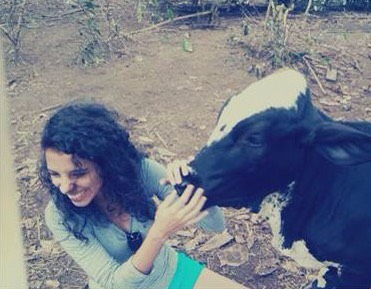
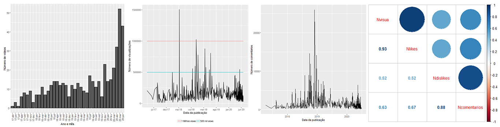
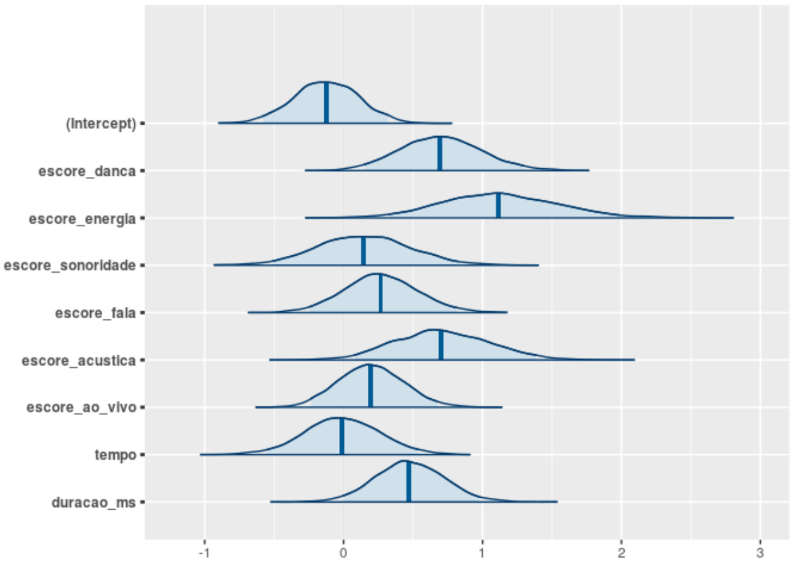
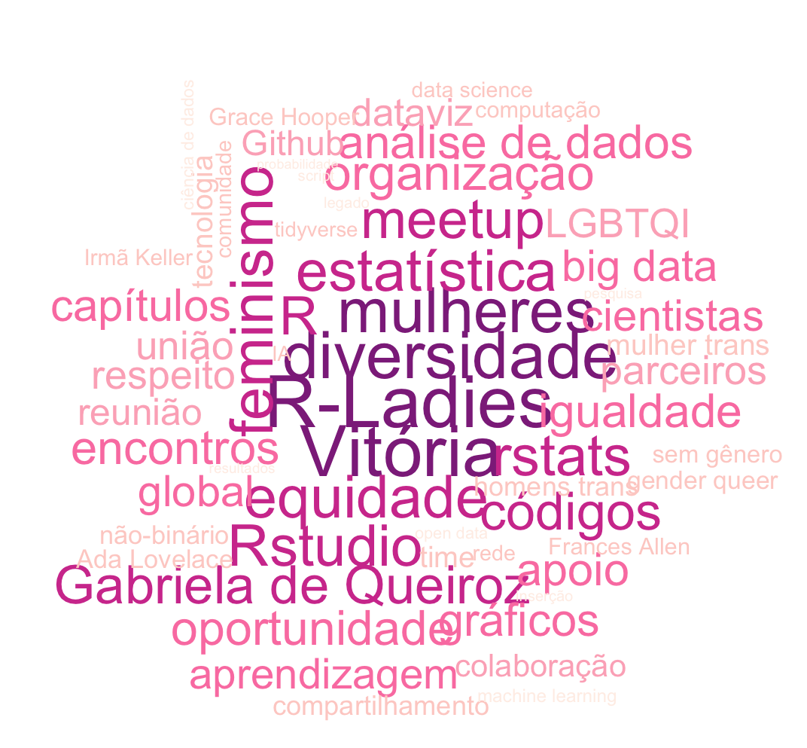
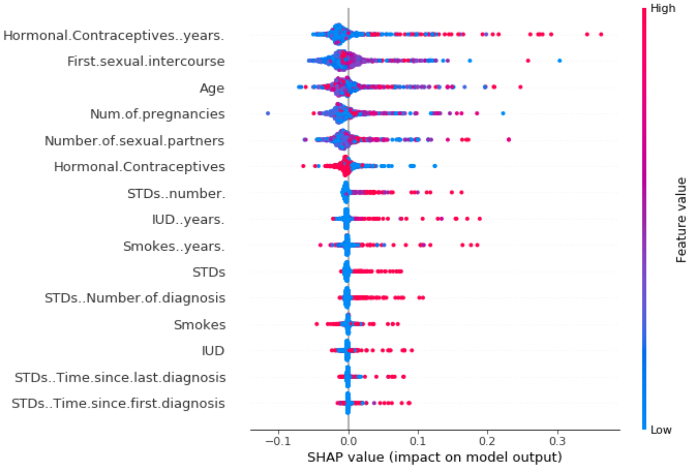
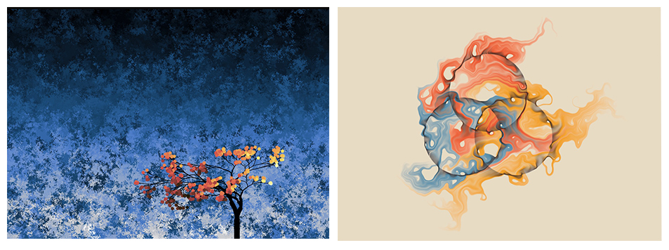
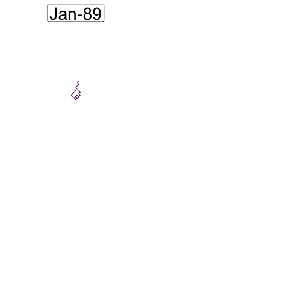
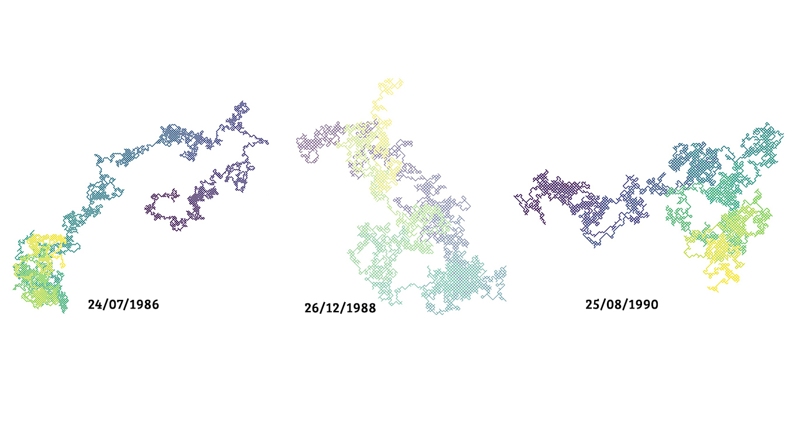
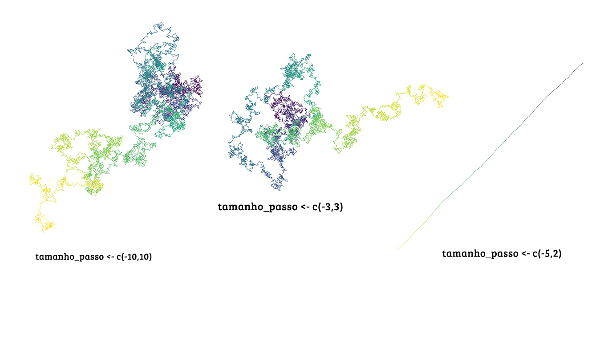
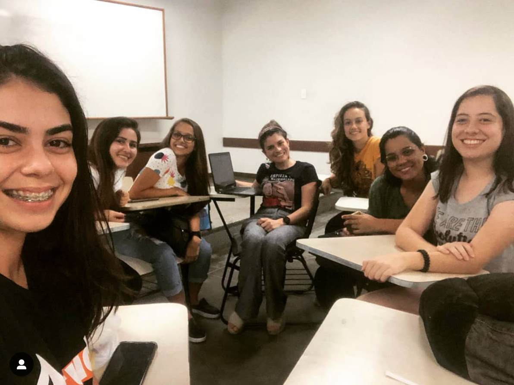

```{r setup, include=FALSE}
knitr::opts_chunk$set(echo = FALSE, fig.align = "center", message = FALSE, 
                      warning = FALSE, comment = "  #>", collapse = T)
```

```{r libs}
#toolbox
 if(!require("tidyverse")){install.packages("tidyverse", dependencies = T); library(tidyverse)}
  if(!require("lubridate")){install.packages("lubridate", dependencies = T); library(lubridate)}
#graphs
 if(!require("viridis")){install.packages("viridis", dependencies = T); library(viridis)}
 if(!require("gganimate")){install.packages("gganimate", dependencies = T); library(gganimate)}
```

class: split-two with-border
.column.bg-main1[.content[
# Sobre mim 

## Ornella Scardua

```{r echo=FALSE, out.width=""}

```
]]
.column.bg-main2[.content[

- Co-organizadora da R-Ladies Vitória.

- Graduanda em Estatística pela Universidade Federal do Espírito Santo (UFES).

- Botafoguense e bávara (Bayern de Munique) doente.

- Apaixonada por cavalos, cinema, ciências agrárias e geopolítica.

- Aos poucos, estou me encantando pela área na qual me meti (principalmente depois de ter assistido à palestra do [Ramon Vilarino](https://br.linkedin.com/in/vilarinoramon) sobre responsabilidade social dos algoritmos).

- Um sonho: antes de partir, ver a Palestina livre.

<br><br><br>Contatos:

- Email: <a href="mailto:ornscar@gmail.com">ornscar@gmail.com</a>
- GitHub: <a href="http://github.com/ornscar">@ornscar</a> 
- Twitter: <a href="http://twitter.com/ornscar">@ornscar</a> 

]]
---
layout: true

<div class="my-footer"><span>

<a href="https://www.meetup.com/pt-BR/R-Ladies-Vitoria">Meetup</a> |
<a href="https://twitter.com/rladiesvix">Twitter</a> | 
<a href="http://instagram.com/rladiesvix">Instagram</a> |
<a href="https://github.com/orgs/rladies/teams/vitoria">GitHub</a> 


</span></div> 

---
class: middle
#R-Ladies Global

```{r rladies, echo=FALSE ,fig.align ='center',out.width = '22%'}
knitr::include_graphics("img/gabriela.jpeg")
```

* Missão: _"A R-Ladies é uma organização mundial cuja missão é promover a diversidade de gênero na comunidade R"_.

* Fundada pela brasileira e estatística [Gabriela de Queiroz](https://www.linkedin.com/in/gabrieladequeiroz) em 1° de outubro de 2012.

* 189 capítulos distribuídos em 54 países e em todos os continentes. Veja o mapa interativo em [**R-Ladies Shiny App**](https://gqueiroz.shinyapps.io/rshinylady/).

* [**Código de Conduta**](https://github.com/rladies/starter-kit/wiki/Code-of-Conduct#portuguese): _"... proporcionar uma experiência livre de assédio para todos"_.

Fonte: [About us - R-Ladies](https://rladies.org/about-us/).

---
class: middle
#R-Ladies Vitória

```{r rladiesvix, echo=FALSE ,fig.align ='center', out.width = '25%'}

```

* Cofundadora: [Agatha S. Rodrigues](https://br.linkedin.com/in/agatha-rodrigues-0a8a6214a), dra. em Estatística e professora do Departamento de Estatística da UFES.

* Nasceu no dia 29 de setembro de 2019.

* Somos em 9 organizadoras e em 115 membros no Meetup.

---
class: middle, center

# O R tem várias funcionalidades, como...

---
class: middle
# ... visualização de dados;

```{r dataviz, echo=FALSE, fig.align ='center', out.width = '105%'}

```

Fonte: [DasLab - UFES: _Analisando o melhor canal do YouTube_](https://daslab-ufes.github.io/meteoro-post/).

---
class: middle
# ... modelagem estatística;

```{r modelagem, echo=FALSE, fig.align ='center', out.width = '55%'}

```

Fonte: [DasLab - UFES: _Construindo playlists no Spotify a partir de modelos probabilísticos_](https://daslab-ufes.github.io/spotify_playlist-post/).

---
class: middle
# ... mineração de texto;

```{r nuvem, echo=FALSE, fig.align ='center',out.width = '50%'}

```

---
class: middle
# ... explicar modelos de _Machine Learning_ (ML); e

```{r shap, echo=FALSE, fig.align ='center', out.width = '55%'}

```

Fonte: [_Interpretable Machine Learning - A Guide for Making Black Box Models Explainable_, por Christoph Molnar](https://christophm.github.io/interpretable-ml-book/shap.html).

---
class: middle
# ... fazer arte.

```{r arte, echo=FALSE, fig.align ='center',out.width = '100%'}

```

Fonte: [Danielle Navarro](https://twitter.com/djnavarro) / [Stonetrees](https://art.djnavarro.net/#pid=23).

Fonte: [Thomas Lin Pedersen](https://twitter.com/thomasp85) /  [genesis4563](https://www.data-imaginist.com/art).

---
class: middle, center

# Mas então é possível fazer um filme da minha vida com R? 

--

<br><br><br> 
#.red[É o que veremos a seguir!]

---
class: middle
# A função _sample_ e a semente

```{r sample1, echo = TRUE, eval = FALSE}
sample(x, size, replace) #sintaxe
```

```{r sample2, echo = TRUE, eval = TRUE}
amostra1 <- sample(LETTERS, 10, replace = TRUE); amostra1

amostra2 <- sample(LETTERS, 10, replace = FALSE); amostra2

amostra3 <- sample(LETTERS, 10, replace = TRUE); amostra3

set.seed(123) #semente

amostra1; amostra2; amostra3
```

---
class: middle, center

# Na vida, nós caminhamos de forma aleatória ou condicionada a algum fator?

---
class: middle
# Os passos aleatórios em x

.left-code[

```{r passosx, echo = TRUE, fig.show = "hide", collapse = TRUE, comment = "  #>", out.width = "90%"}
set.seed(1)

tamanho_passo <- c(-1,1)

n <- 5 

passos_aleatorios_x <- c(0, sample(tamanho_passo, n, 
                        replace = TRUE))

plot(passos_aleatorios_x, 0:n, xlab = "decisão", #<<
     ylab = "tempo") #<<

```

]

--

.right-plot[

`)

]

---
class: middle
# Os passos aleatórios acumulados em x

.left-code[

```{r acumx, echo = TRUE, fig.show = "hide", collapse = TRUE, comment = "  #>", out.width = "90%"}

passos_aleatorios_acum_x <- cumsum(passos_aleatorios_x)

plot(passos_aleatorios_acum_x, 0:n, xlab = "posição", #<<
     ylab = "tempo", #<<
     type = "l") #<<

points(passos_aleatorios_acum_x, 0:n) #<<

```

]

--

.right-plot[

`)

]

---
class: middle
# Os passos aleatórios em y

.left-code[

```{r passosy, echo = TRUE, fig.show = "hide", collapse = TRUE, comment = "  #>", out.width = "90%"}

passos_aleatorios_y <- c(0, sample(tamanho_passo, n, 
                        replace = TRUE))

plot(0:n, passos_aleatorios_y, xlab = "tempo", #<<
     ylab = "decisão") #<<

```

]

--

.right-plot[

`)

]

---
class: middle
# Os passos aleatórios acumulados em y

.left-code[

```{r acumy, echo = TRUE, fig.show = "hide", collapse = TRUE, comment = "  #>", out.width = "90%"}

passos_aleatorios_acum_y <- cumsum(passos_aleatorios_y)

plot(0:n, passos_aleatorios_acum_y, xlab = "tempo", #<<
     ylab = "posição", #<<
     type = "l") #<<

points(0:n, passos_aleatorios_acum_y) #<<

```

]

--

.right-plot[

`)

]

---
class: middle, center

# Começando a construir o filme da sua vida...

---
class: middle
# Definindo o início e o  fim do seu roteiro

```{r dados, echo = TRUE, eval = TRUE}
hoje <- today() #pacote lubridate

data_nascimento <- as.Date("1988-12-26")

n_passos <- as.numeric(hoje - data_nascimento)

tamanho_passo <- c(-1,1)

set.seed(261288)

```

---
class: middle
# Seus passos aleatórios em x e em y

```{r seusxy, echo = TRUE, fig.show = "hide", collapse = TRUE, comment = "  #>", out.width = "90%"}
#passos x
passos_aleatorios_x <- c(0, sample(tamanho_passo, n_passos, replace = TRUE))

passos_aleatorios_acum_x <- cumsum(passos_aleatorios_x)

#passos y
passos_aleatorios_y <- c(0, sample(tamanho_passo, n_passos, replace = TRUE))

passos_aleatorios_acum_y <- cumsum(passos_aleatorios_y)
```

---
class: middle
# Filme da sua vida em preto e branco

.left-code[

```{r filmepb, echo = TRUE, fig.show = "hide", collapse = TRUE, comment = "  #>", out.width = "90%"}
plot(passos_aleatorios_acum_x, #<<
     passos_aleatorios_acum_y, #<<
     type = "l") #<<
```

]

--

.right-plot[

`)

]

---
class: middle, center
# Modernizando o seu filme...

---
class: middle
# Roteiro do seu filme

```{r roteiro, echo = TRUE, fig.show = "hide", collapse = TRUE, comment = "  #>", out.width = "90%"}
#pacote tidyverse

roteiro <- tibble(px = passos_aleatorios_x, py = passos_aleatorios_y, x = passos_aleatorios_acum_x,
                     y = passos_aleatorios_acum_y, tempo = 0:n_passos, 
                     dias = format(seq.Date(from = data_nascimento, 
                                            to = hoje, by = "days"),
                                   format = "%b-%y"))
tail(roteiro) 

```

---
class: middle
# Revolucionando seu filme com _ggplot2_

.left-code[

```{r gg1, echo = TRUE, fig.show="hide", collapse = TRUE, comment = "  #>", out.width="90%"}
#pacote ggplot2

g <- ggplot(roteiro) #<<
g
  
```
]

--

.right-plot[
`)
]

---
class: middle
# Revolucionando seu filme com _ggplot2_
.left-code[

```{r gg2, echo = TRUE, fig.show="hide", collapse = TRUE, comment = "  #>", out.width="90%"}
g <- ggplot(roteiro, aes(x = x, y = y)) #<<
g
  
```
]

--

.right-plot[
`)
]

---
class: middle
# Revolucionando seu filme com _ggplot2_

.left-code[

```{r gg3, echo = TRUE, fig.show="hide", collapse = TRUE, comment = "  #>", out.width="90%"}
g <- ggplot(roteiro, aes(x = x, y = y)) +
  geom_path() #<<
g
  
```
]

--


.right-plot[
`)
]

---
class: middle
# Revolucionando seu filme com _ggplot2_

.left-code[

```{r gg4, echo = TRUE, fig.show="hide", collapse = TRUE, comment = "  #>", out.width="90%"}
g <- ggplot(roteiro) +
  geom_path(aes(x = x, y = y), colour = "red") #<<
g
  
```

]

--

.right-plot[
`)

]

---
class: middle
# Revolucionando seu filme com _ggplot2_

.left-code[

```{r gg5, echo = TRUE, fig.show="hide", collapse = TRUE, comment = "  #>", out.width="90%"}
g <- ggplot(roteiro) +
  geom_path(aes(x = x, y = y, colour = tempo)) #<<
g
  
```
]

--

.right-plot[
`)

]

---
class: middle
# Revolucionando seu filme com _ggplot2_
.left-code[

```{r gg6, echo = TRUE, fig.show="hide", collapse = TRUE, comment = "  #>", out.width="90%"}
g <- ggplot(roteiro) +
  geom_path(aes(x = x, y = y, colour = tempo)) +
  scale_color_viridis_c() #<<
g
  
```
]

--

.right-plot[
`)

]

---
class: middle
# Revolucionando seu filme com _ggplot2_

.left-code[

```{r gg7, echo = TRUE, fig.show="hide", collapse = TRUE, comment = "  #>", out.width="90%"}
g <- ggplot(roteiro) +
  geom_path(aes(x = x, y = y, colour = tempo)) +
  scale_color_viridis_c() +
  coord_equal() #<<
g
  
```
]

--

.right-plot[
`)

]

---
class: middle
# Revolucionando seu filme com _ggplot2_

.left-code[

```{r gg8, echo = TRUE, fig.show="hide", collapse = TRUE, comment = "  #>", out.width="90%"}
g <- ggplot(roteiro) +
  geom_path(aes(x = x, y = y, colour = tempo)) +
  scale_color_viridis_c() +
  coord_equal() +
  theme_void() #<<
g
  
```
]

--

.right-plot[
`)
]

---
class: middle
# Revolucionando seu filme com _ggplot2_

.left-code[

```{r gg9, echo = TRUE, fig.show="hide", collapse = TRUE, comment = "  #>", out.width="90%"}
g <- ggplot(roteiro) +
  geom_path(aes(x = x, y = y, colour = tempo)) +
  scale_color_viridis_c() +
  coord_equal() +
  theme_void() +
  theme(legend.position = "none") #<<
g
  
```
]

--

.right-plot[
`)
]

---
class: middle
# Animando seu filme com _gganimate_

.left-code[

```{r filme, echo = TRUE, fig.show="hide", collapse = TRUE, comment = "  #>", out.width="90%", eval = FALSE}
g <- ggplot(roteiro) +
  geom_path(aes(x = x, y = y, colour = tempo)) +
  scale_color_viridis_c() +
  coord_equal() +
  theme_void() +
  theme(legend.position = "none") +
  geom_label(aes(x = 0, y = 50, label = dias), #<<
             size = 10) #<<

#gganimate

animacao <- g + transition_reveal(tempo) #<<

filme_da_sua_vida <- animate(animacao, #<<
        renderer = gifski_renderer(), #<<
        duration = 60, #<<
        nframes = 200) #<<

anim_save("gif/filme.gif", filme_da_sua_vida) #<<
```

]

--

.right-plot[


]

---
class: middle, center
# O que Lacan diria sobre essas pessoas?

```{r lacan, echo=FALSE ,fig.align ='center',out.width = '65%'}

```

---
class: middle

```{r filmes, echo=FALSE ,fig.align ='center',out.width = '100%'}

```

---
class: middle, center
# E se déssemos passos de tamanhos diferentes?

---
class: middle

```{r tampassos, echo=FALSE ,fig.align ='center',out.width = '100%'}

```

---
class: middle
#Agradecimentos

```{r rconsortium, echo=FALSE ,fig.align ='center',out.width = '25%'}
knitr::include_graphics("img/rconsort.png")
```

* À RConsortium;

* ao [Bruno Santos](https://br.linkedin.com/in/bruno-santos-a9a9908), professor de Estatística da UFES;

* às amigas de curta e longa data;

* à professora [Agatha Rodrigues](https://br.linkedin.com/in/agatha-rodrigues-0a8a6214a); e

* ao público que me assistiu.

---
class: middle, center
#Muito obrigada!

```{r ladies, echo=FALSE ,fig.align ='center',out.width = '55%'}

```


